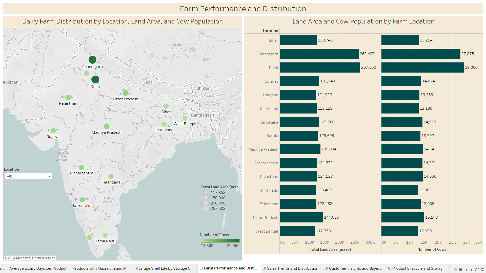
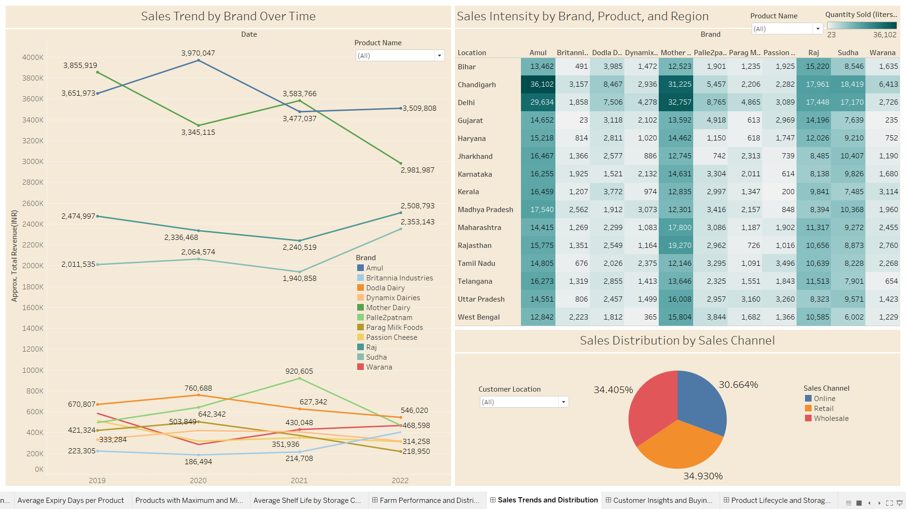
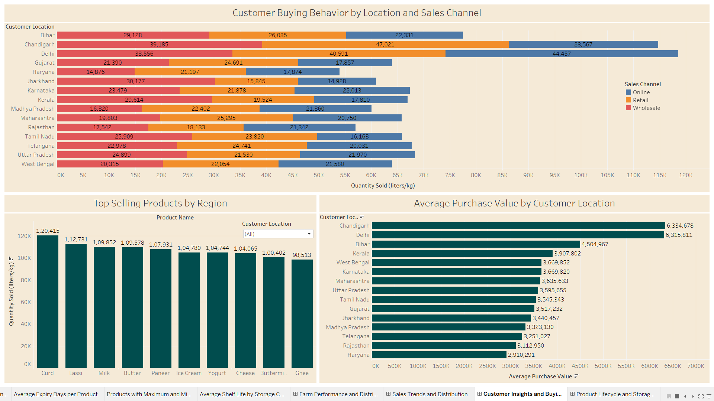
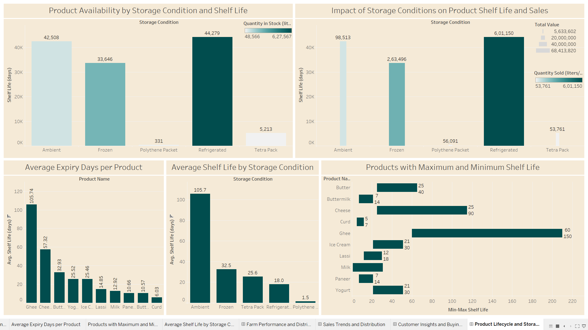
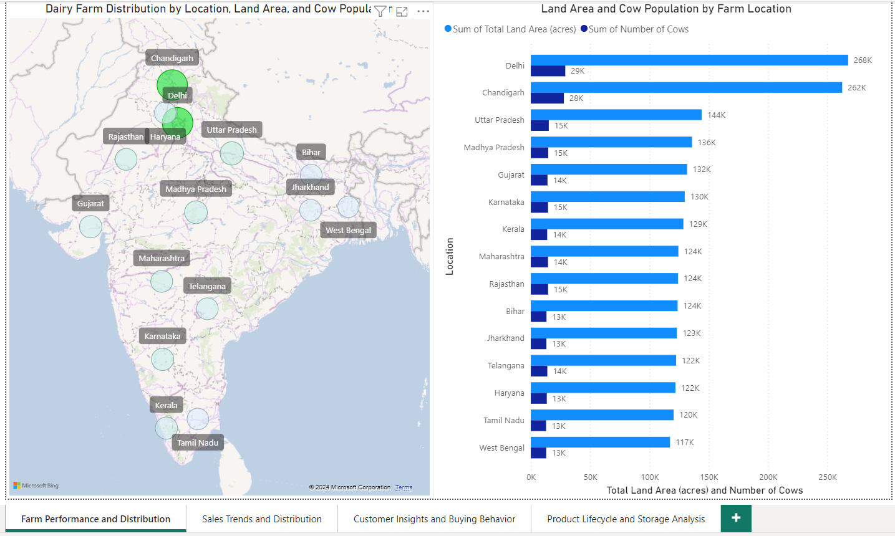
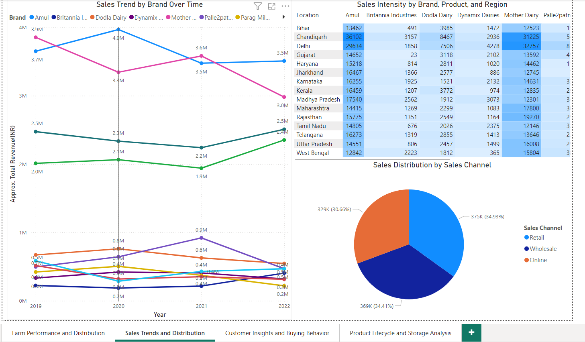
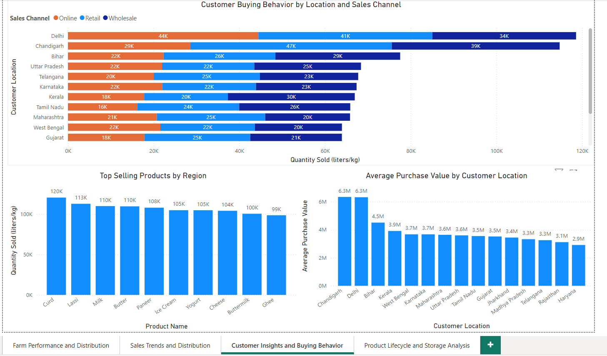
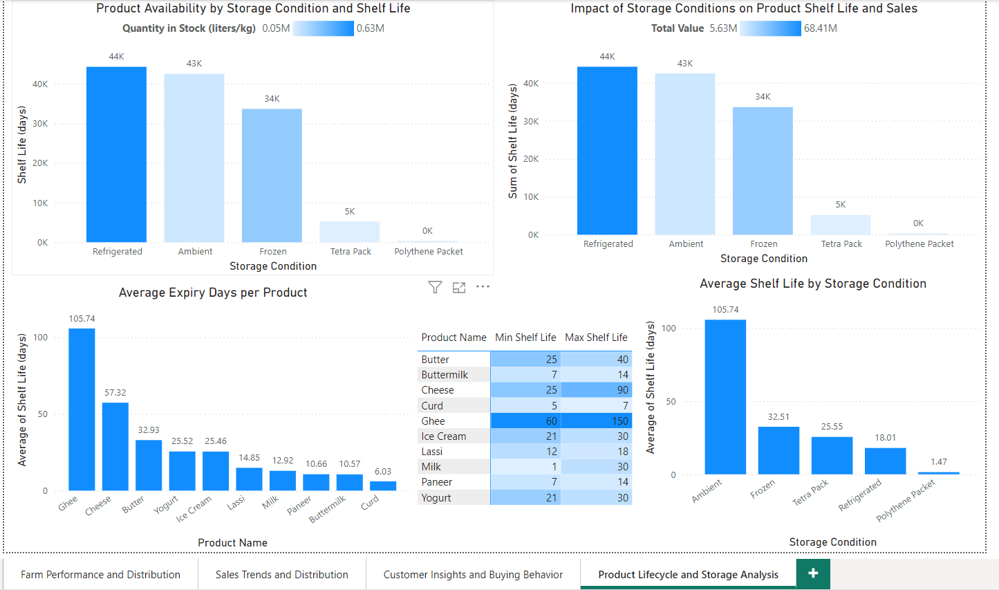

# Dairy Goods Sales Analysis

This project analyzes dairy goods sales data to uncover key insights about sales trends, customer behavior, product performance, and storage conditions. The analysis was performed using Tableau and Power BI to create interactive visualizations and dashboards.

## Project Overview

The primary objective of this project is to analyze the sales data of dairy products across various regions in India. This analysis helps in understanding sales trends by brand, product distribution, customer buying behavior, and the impact of storage conditions on product shelf life and sales.

## Dataset

The dataset used in this project is the "Dairy Goods Sales Dataset" from Kaggle.

Dataset source: [Dairy Goods Sales Dataset on Kaggle](https://www.kaggle.com/datasets/suraj520/dairy-goods-sales-dataset)

## Dashboard Components

The project consists of four main dashboards:

1. **Farm Performance and Distribution**
   - Dairy Farm Distribution by Location, Land Area, and Cow Population
   - Land Area and Cow Population by Farm Location

2. **Sales Trends and Distribution**
   - Sales Trend by Brand Over Time
   - Sales Intensity by Brand, Product, and Region
   - Sales Distribution by Sales Channel

3. **Customer Insights and Buying Behavior**
   - Customer Buying Behavior by Location and Sales Channel
   - Top Selling Products by Region
   - Average Purchase Value by Customer Location

4. **Product Lifecycle and Storage Analysis**
   - Product Availability by Storage Condition and Shelf Life
   - Impact of Storage Conditions on Product Shelf Life and Sales
   - Average Expiry Days per Product
   - Average Shelf Life by Storage Condition
   - Products with Maximum and Minimum Shelf Life

## Key Insights

1. **Regional Sales Distribution**: Delhi and Chandigarh show the highest sales volumes across most brands, with Amul being particularly strong in these regions. This suggests a need for targeted marketing and distribution strategies in high-performing areas.

2. **Brand Performance**: Amul consistently outperforms other brands across regions. In 2022, Amul's sales reached approximately 3.5 million units, significantly higher than competitors like Mother Dairy and Sudha.

3. **Sales Channel Effectiveness**: The sales distribution is relatively balanced across channels, with Online (34.41%), Retail (34.93%), and Wholesale (30.66%). This multi-channel approach appears effective in reaching diverse customer segments.

4. **Product Popularity**: Curd is the top-selling product with over 120,000 units sold, followed closely by Lassi and Milk. This indicates a strong consumer preference for traditional dairy products.

5. **Storage Impact on Shelf Life**: Ambient storage conditions allow for the longest shelf life (average 105.7 days), while products in polythene packets have the shortest (1.5 days). This highlights the critical role of packaging and storage in product longevity.

6. **Regional Buying Behavior**: Chandigarh shows the highest average purchase value at ₹15,863, suggesting higher disposable income or stronger dairy consumption habits in this region.

7. **Seasonal Trends**: The sales trend graph shows fluctuations over time, with peaks possibly corresponding to festive seasons or summer months when dairy consumption typically increases.

8. **Product Lifecycle Variability**: There's a wide range in product shelf life, from 1 day for some products to 150 days for others (e.g., Ghee). This variability significantly impacts inventory management and distribution strategies.

9. **Farm Performance Correlation**: States with larger land areas for dairy farms (e.g., Delhi, Chandigarh) also show higher cow populations and generally higher sales volumes, indicating a strong farm-to-market supply chain.

10. **Brand Diversity Impact**: Regions with a more diverse brand presence (visible in the sales intensity heatmap) tend to have higher overall sales volumes, suggesting that brand competition may stimulate market growth.

## Tools Used

- **Tableau**: Created interactive dashboards for visualizing sales data, farm performance, customer insights, and product lifecycle analysis.
- **Power BI**: Developed similar dashboards to those in Tableau, providing an alternative view of the data and insights.

## Visualizations

The project includes interactive dashboards created using both Tableau and Power BI:

- **Tableau Dashboards**: Four detailed dashboards analyzing various aspects of the dairy goods sales data.
  - 
  - 
  - 
  - 

- **Power BI Dashboards**: Similar set of four dashboards providing insights on sales performance, customer behavior, and product analysis.
  - 
  - 
  - 
  - 

## How to Explore This Project

1. **Tableau Dashboards**: 
   - View the dashboards on [Tableau Public](https://public.tableau.com/views/DairyGoodsSalesAnalysis/ProductLifecycleandStorageAnalysis?:language=en-GB&publish=yes&:sid=&:redirect=auth&:display_count=n&:origin=viz_share_link)
   - Download the `.twbx` file from the `visualizations/tableau/` directory to explore locally with Tableau Desktop

2. **Power BI Dashboards**: 
   - Download the `.pbix` file from the `visualizations/power_bi/` directory to explore with Power BI Desktop
